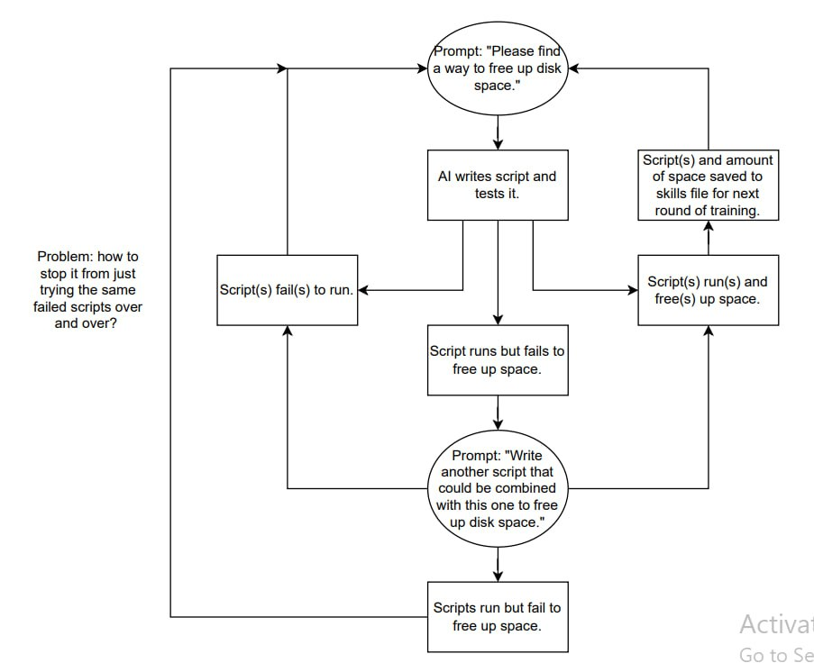

# Generalisation
Code for a generalising agent
**Project Flow**

** Chain of thought prompting

# How to use
`python3 Agent_v1.py`

# Result
`.pkl` file in /media ( or whatever directory was set in)
`app.log` file in /logs